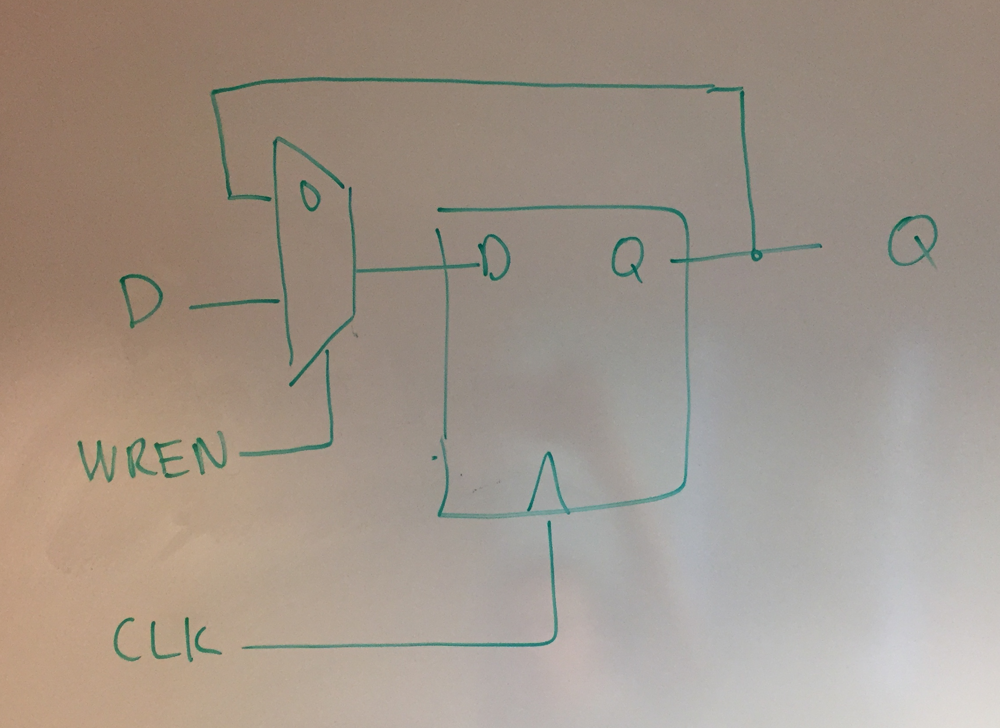
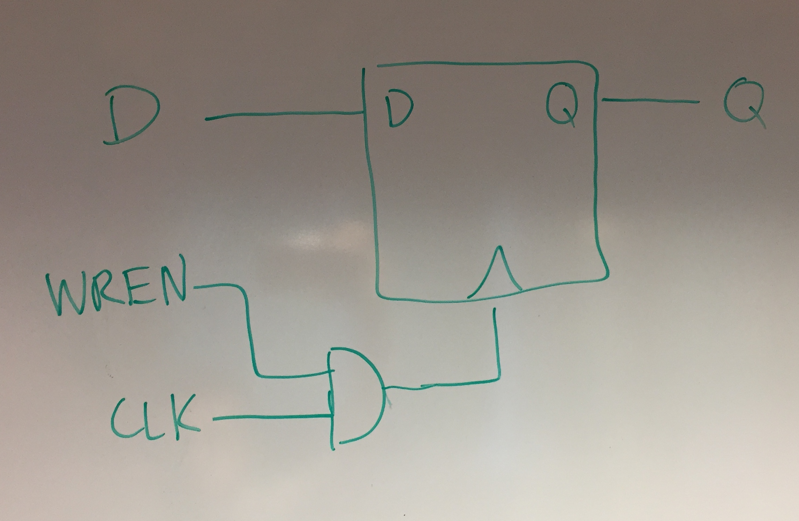

# Homework 4
### Alexander Hoppe

## Deliverable 1

The first implementation uses a multiplexer to control whether or not the device is taking new inputs or just using its previous one.



The second implementation uses an AND gate on the CLK line, which is less robust to glitches in the WREN signal. If WREN glitches high during the high period of the CLK signal, the flipflop will pass through the state of the D pin, which is not the intended behavior.



## Deliverable 6

```verilog
module decoder1to32
(
output[31:0]  out,
input         enable,
input[4:0]    address
);
    assign out = enable<<address;
endmodule
```

This module works as a decoder (sets one bit high based on address) by left shifting the enable register. If the device is enabled, enable will be `1'b1`. If it's not enabled, the enable will be `1'b0`. The next step is the left shift. If the address is 12 and the enable bit is high, the decoder will do `1'b1 << 12` which is `12'b100000000000`, a register with the 12th bit high. This is the behavior of a decoder. 
