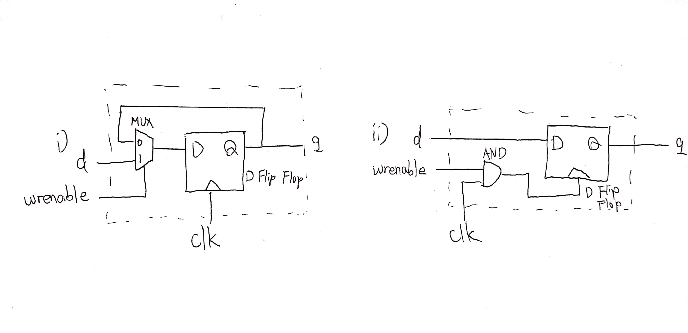

Deliverable 1 : 

The first picture is the register circuit that implements the following code.

~~~
module register
(
output reg  q,
input       d,
input       wrenable,
input       clk
);
    always @(posedge clk) begin
        if(wrenable) begin
            q = d;
        end
    end
endmodule
~~~

The second picture is the register circuit that changes the always block of the above code into the following code.

~~~
always @(posedge (clk & wrenable)) begin
	q = d;
end
~~~

Deliverable 2 ~ 5 : in 'register.v'

Deliverable 6 : in 'decoders.v' as comments

Deliverable 7 : in 'regfile.v'

Deliverable 8 : in 'regfile.t.v'