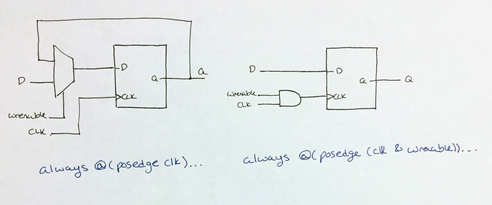

# HW 4 "Report"

## Deliverable 1

## Deliverable 6
Enable is set to be the least significant bit of out. The
value of address (which can be between 0 and 31) indicates
the number of bits out should be be shifted left by.

So, the decoder selects the register which is being written to (if any)
by using the value of adress.